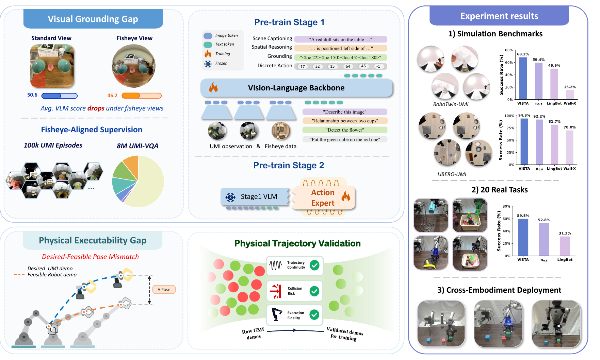

<div align="center">

# VISTA: Vision-Grounded and Physics-Validated Adaptation of UMI data for VLA Training

[](https://arxiv.org/abs/2606.04708)
[](https://tele-umi-vista.github.io)
[](https://huggingface.co/collections/TeleEmbodied/vista)
[](https://huggingface.co/collections/TeleEmbodied/vista)
[](LICENSE)



</div>

## Overview

VISTA adapts UMI-collected data for VLA training by addressing two key gaps: wrist-fisheye observations are out of distribution for pretrained VLMs, and human-collected trajectories can be physically infeasible for target robots. The framework combines UMI-VQA for visual grounding, a physical-validation pipeline for trajectory curation, and two-stage post-training for VLA policy learning.

## Status

This repository is currently an initial skeleton. Code cleanup is in progress.

The released datasets and pretrained model checkpoints are hosted in the Hugging Face collection linked above.

## What We Plan to Open Source

This repository will organize the VISTA code release around three main parts:

1. **Post-training code**
   - Stage-1 VQA-action autoregressive co-training.
   - Stage-2 continuous action expert training.
   - Downstream fine-tuning utilities for VISTA-style UMI data.

2. **Simulation evaluation code**
   - RoboTwin-UMI benchmark adaptation and evaluation scripts.
   - LIBERO-UMI benchmark adaptation and evaluation scripts.
   - Configuration examples for running policies under wrist-fisheye observation settings.

3. **Physical-validation pipeline**
   - Data-completeness pre-checks.
   - Trajectory continuity scoring.
   - Self-collision risk scoring.
   - Execution-fidelity scoring.
   - Embodiment-conditioned overall trajectory scoring.

## Repository Layout

```text
umi-vista/
  README.md
  assets/                           # README images and lightweight media assets
  post_training/                    # VISTA post-training and fine-tuning code
  simulation_evaluation/
    robotwin_umi/                   # RoboTwin-UMI evaluation code
    libero_umi/                     # LIBERO-UMI evaluation code
  physical_validation/              # Physical-validation pipeline
  configs/                          # Future configuration examples
  scripts/                          # Future helper scripts and launch wrappers
  examples/                         # Future minimal examples
  docs/                             # Extended documentation
  tests/                            # Future smoke tests and validation tests
```

Each directory currently contains a short README describing its intended role. Implementation files will be added as the internal code is cleaned and prepared for release.

## Data and Model Assets

Large assets are distributed separately through Hugging Face:

- UMI-VQA resources
- Validated trajectory data
- Pretrained model checkpoints

Collection: https://huggingface.co/collections/TeleEmbodied/vista

## License

This project is released under the Apache License 2.0.

## Citation

If you find VISTA useful, please cite the paper:

```bibtex
@misc{yang2026vistavisiongroundedphysicsvalidatedadaptation,
      title={VISTA: Vision-Grounded and Physics-Validated Adaptation of UMI data for VLA Training}, 
      author={Siyuan Yang and Linzheng Guo and Ouyang Lu and Zhaxizhuoma and Daoran Zhang and Xinmiao Wang and Ting Xiao and Fangzheng Yan and Zhijun Chen and Yan Ding and Chao Yu and Chenjia Bai and Xuelong Li},
      year={2026},
      eprint={2606.04708},
      archivePrefix={arXiv},
      primaryClass={cs.RO},
      url={https://arxiv.org/abs/2606.04708}, 
}
```
